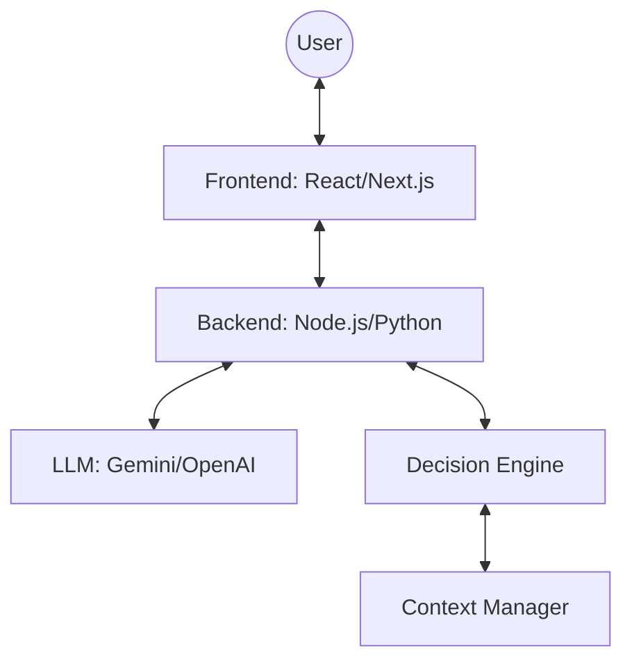

# WhyGift — AI Co-Thinker Architecture & Build Plan

WhyGift is a decision-support system designed to help users move from "I don't know what to get" to "I have a clear, meaningful direction" through guided AI conversation.

## 1. SYSTEM OVERVIEW

### High-Level Architecture


### Core Components
- **Chat Interface**: Guided conversation for input.
- **Context Engine**: Tracks recipient traits, constraints, and emotional intent.
- **Decision Engine**: Translates intent into gift attributes and directions.
- **Dynamic Panel**: Visualizes the current state of the decision (Recipient Snapshot, Confidence, Directions).

---

## 2. PHASE-WISE ARCHITECTURE

### PHASE 1 — CORE AI + BASIC INTERFACE
**Goal**: A working chat interface where the AI acts as a "Gift Co-Thinker".

- **Frontend**: Simple chat console (messages list + input).
- **Backend**: `/chat` endpoint that forwards messages to the LLM.
- **LLM**: System prompt defining the "Co-Thinker" role (probing, empathetic, non-market-focused).
- **Sample Prompt**: `"You are WhyGift, a senior gift architect. Your goal is to ask insightful questions to understand the 'why' behind a gift. Do not suggest products yet; focus on the person and the feeling."`

### PHASE 2 — STRUCTURED CONVERSATION + CONTEXT
**Goal**: Guided conversation with memory of the recipient.

- **Context Manager**: Backend logic to extract and store JSON blocks representing the "Recipient Profile".
- **Stage Logic**: The AI is instructed to move through phases: (1) Recipient Discovery -> (2) Intent Clarification -> (3) Direction Synthesis.
- **API**: `/chat` returns both text and a `context` object.
- **UI**: Display "Recipient Snapshot" (e.g., "Age: 30, Hobby: Gardening") as it's discovered.

### PHASE 3 — DECISION ENGINE (CORE LOGIC)
**Goal**: Transparent and explainable mapping from intent to directions.

- **Logic**: Map qualitative intent (e.g., "Make them feel appreciated for their hard work") to gift attributes (e.g., "Relaxation", "Utility", "Physical Comfort").
- **Gift Directions**: Broad categories like "The Ultimate Relaxation kit" or "A skill-building experience".
- **Confidence Score**: A calculated metric based on the completeness of the Recipient Profile and Intent clarity.

### PHASE 4 — FRONTEND EXPERIENCE (UX LAYER)
**Goal**: Low cognitive load with a dual-panel layout.

- **Left Panel**: Conversational UI with interactive chips/toggles for quick responses.
- **Right Panel**: 
    - **Recipient Snapshot**: Real-time summary.
    - **Intent**: The "Why" summary.
    - **Gift Directions**: 2-3 structured directions with reasoning.
    - **Confidence Score**: Gauge (0-100%).

### PHASE 5 — ADVANCED INTERACTION + ORCHESTRATION
**Goal**: Interactive "What-If" simulations.

- **Simulator**: User can change a constraint (e.g., "What if I wanted it to be more practical?") and see the Directions/Score update instantly.
- **Orchestration**: Backend coordinates multiple LLM calls if needed (one for chat, one for direction extraction).
- **Optimization**: Stream LLM responses for lower perceived latency.

### PHASE 6 — TESTING + DEPLOYMENT
**Goal**: Production-ready MVP.

- **Testing**: Scenarios for "Vague User" (help them start) and "Contradictory User" (resolve conflict).
- **Deployment**: Next.js on Vercel; Backend on Render/AWS.
- **Metrics**: Track "Decision Time" and "User Confidence" (via feedback loop).

---

## 3. TECH STACK
- **Frontend**: React (Next.js), Vanilla CSS, Tailwind (optional if requested).
- **Backend**: Node.js (Express) or Python (FastAPI).
- **LLM**: Google Gemini 1.5 Pro (preferred) or OpenAI GPT-4o.
- **State**: React Context for UI state; In-memory or Redis for session state.

---

## 4. API DESIGN

### `POST /chat`
**Request**: `{ "message": "They love coffee", "sessionId": "123" }`
**Response**: `{ "text": "That's a great start!...", "contextUpdate": { "hobby": "coffee" }, "stage": "discovery" }`

### `GET /decision`
**Response**: `{ "directions": [...], "confidence": 85, "reasoning": "..." }`

---

## 5. DATA MODEL (JSON SCHEMAS)

### Recipient Profile
```json
{
  "age_range": "STRING",
  "archetypes": ["STRING"],
  "hobbies": ["STRING"],
  "constraints": { "budget": "NUMBER", "location": "STRING" }
}
```

### Gift Direction
```json
{
  "title": "STRING",
  "reasoning": "STRING",
  "attributes": ["STRING"],
  "sentiment": "STRING"
}
```

---

## 6. LLM DESIGN
- **System Prompt**: Multi-layered. (1) Identity, (2) Persona constraints (no products), (3) Extraction instructions (JSON output).
- **Prompt Chaining**: Use a "Thinking" chain: User Message -> Extract Context -> Determine Stage -> Generate Response.

---

## 7. MVP SIMPLIFICATIONS
- **Hardcoded**: Selection of initial archetypes (e.g., "The Creator", "The Relaxer").
- **Skipped**: External product API integrations (keep it as a "Co-Thinker" only).
- **Memory**: Session-based memory only (no permanent DB initially).

---

## VERIFICATION PLAN

### Automated Tests
1. **API Contract Test**: 
   - Run `npm test` (to be created) to verify `/chat` returns correct JSON structure.
2. **LLM Extraction Mock**:
   - Provide a set of chat logs and verify the "Recipient Profile" is correctly updated.

### Manual Verification
1. **Flow Test**: Walk through a full conversation from "Hello" to "Gift Direction" to ensure stage progression works.
2. **What-If Test**: Toggle a "Practical vs Emotional" slider and verify the panel updates correctly.
